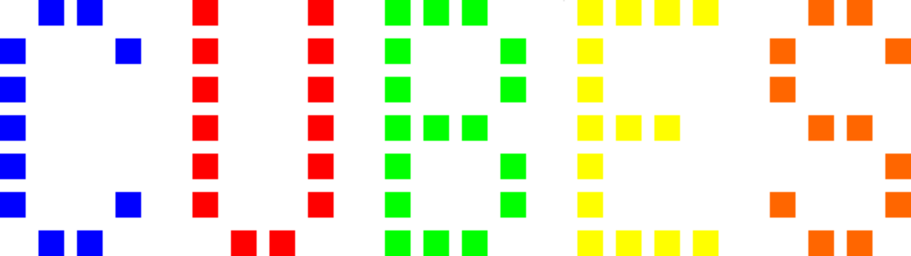



Velkommen til min side om speedsolving.

Her på siden kan du finde forskellige metoder til at løse en Rubik's Cube. Der er metoder for begyndere og øvede samt fifs til at få det til at gå endnu hurtigere.

Følgende metoder er beskrevet på denne side:			
- <a href="../loesningsmetoder/awesome/">Begynder</a> - En Rubik's Cube kan løses med kun syv forskellige trin.
- <a href="../loesningsmetoder/epic">Videregående</a> - Du har lyst til at lære en simpel metode til at løse en Rubik's Cube på < 1 minut.
- <a href="../loesningsmetoder/legendary">Øvet</a> - Du er blevet bidt af en gal firkant! Her er metoden til at løse den på < 30 sekunder.
- <a href="../loesningsmetoder/onfire">Ekspert</a> - Du behersker den ovenstående metode og er på jagt efter tider < 15 sekunder.

For at få noget ud af siden, kræver det du kender nogle simple notationer, som bruges til at beskrive forskellige træk på terningen. hvis du ikke har kendskab til disse skal du lige forbi <a ref="">her</a> først.

Hvis du har spørgsmål, forslag til forbedringer eller nye emner der burde tages op kan der smides en mail på: brian dot v dot danielsen at gmail dot com.

God fornøjelse!