# Videregående

På denne side kan der ses hvordan man laver et hurtigere sidste lag på terningen. Dette er også kaldt 4 Look Last Layer (4LLL). Der er også metoder til at løse de første to lag lidt hurtigere.
						

## First two Layers (F2L)

F2L er den del af løsningen der kan vindes mest tid. Samtidig er det er også den del, der er sværest at mestre. Derfor er det en god idé nu allerede at begynde at tænke over placeringen af kant-stykket i forhold til hjørnestykket når man sætter dem ned.

"badmephisto" har lavet en rigtig god F2L video tutorial i to dele på YouTube:
- <a href="http://www.youtube.com/watch?v=k-xbcAMfWwM">Rubik's Cube: Fridrich F2L explained (PART 1/2)</a>
- <a href="http://www.youtube.com/watch?gl=CA&hl=en&v=4GxLM_dZqg4">Rubik's Cube: Fridrich F2L explained (PART 2/2)

_Links sidst tjekket: 2010-04-04_

Det er endnu ikke så vigtigt at mestre F2L, så jeg råder dig til ikke at lægge for mange kræfter i at forstå hvad videoer viser, bare hav det i baghovedet. Der er stadig meget tid at hente i det sidste lag, når du mestre det, kan du vente tilbage til F2L.

Tabellen nedenunder indeholder algoritmer tilat placere hjørnerne hurtigere end begyndermetoden. Det vil forbedre dine tider at lære de tre algoritmer og bruge dem til hjørnerne i det første lag.

<table class="cube_table">			
  <th colspan="6">F2L</th>			
  <tr>
    <td class="cube_table_case_td">01</td>
    <td class="cube_table_cube_td">				
      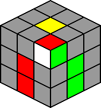			
    </td>
    <td class="cube_table_algorithm_td">F’ U’ F</td>			
    <td class="cube_table_case_td">02</td>
    <td class="cube_table_cube_td">		
      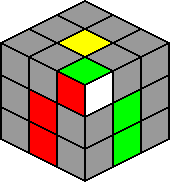	
    </td>		
    <td class="cube_table_algorithm_td">R U R'</td>	
  </tr>		
  <tr>
    <td class="cube_table_case_td">03</td>			
    <td class="cube_table_cube_td">	
      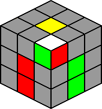	
    </td>					
    <td class="cube_table_algorithm_td">R U2 R' U' R U R'</td>			
    <td></td>
    <td class="cube_table_cube_td">			
    </td>			
    <td class="cube_table_algorithm_td">
  </td>		
  </tr>
</table>

## 4 Look Last Layer (4LLL)

Ligesom i begyndermetoden skal der være et kryds i top-laget på ternigen. Herefter vil et af mønstrene illustreret i nedenstående tabel være i top-laget på terningen.

Idenficér mønstret og udfør algoritmen til højre for det. Hvis dette gøres rigtigt skulle alle stykker gerne vende rigtigt.

<table class="cube_table">			
  <th colspan="6">OLL</th>			
  <tr>
    <td class="cube_table_case_td">01</td>			
    <td class="cube_table_cube_td">				
      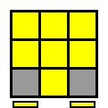			
    </td>
    <td class="cube_table_algorithm_td">(R'2 D)(R' U2)(R D')(R' U2 R')</td>			
    <td class="cube_table_case_td">02</td>
    <td class="cube_table_cube_td">		
    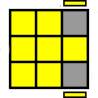	
    </td>		
    <td class="cube_table_algorithm_td">(Lw' U')(L U)(R U')(Rw' F)</td>	
  </tr>		
  <tr>
    <td class="cube_table_case_td">03</td>			
    <td class="cube_table_cube_td">	
      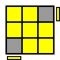	
    </td>					
    <td class="cube_table_algorithm_td">(R' F)(R B')(R' F')(R B)</td>			
    <td class="cube_table_case_td">04</td>
    <td class="cube_table_cube_td">			
    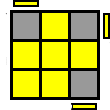	
    </td>			
    <td class="cube_table_algorithm_td">(R U R' U)(R U'2 R')</td>		
  </tr>	
  <tr>
    <td class="cube_table_case_td">05</td>			
    <td class="cube_table_cube_td">	
    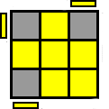	
    </td>	
    <td class="cube_table_algorithm_td">	
    (L' U' L U')(L' U2 L)		
    </td>
    <td class="cube_table_case_td">06</td>				
    <td class="cube_table_cube_td">			
      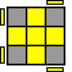	
    </td>			
    <td class="cube_table_algorithm_td">(R U'2)(R2 U')(R2 U')(R'2 U'2 R)</td>		
  </tr>	
  <tr>
    <td class="cube_table_case_td">07</td>
    <td class="cube_table_cube_td">		
      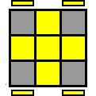
    </td>			
    <td class="cube_table_algorithm_td">F (R U R' U')(R U R' U')(R U R' U') F'</td>
    <td></td>			
    <td class="cube_table_cube_td"></td>			
    <td class="cube_table_algorithm_td"></td>
  </tr>		
</table>
  
Efter orientering af U-laget skal hjørnerne sættes på plads. Dette gøres ved at benytte nedenstående algoritme:
> R' F R' B2 R F' R' B2 R2

Det er vigtigt, at hvis der er "forlygter" på terningen, det vil sige at to hjørner vender således at de har samme farve, skal være på B-siden af terningen. Hvis det ikke er tilfældet, kan ovenstående algoritme udføres en gang hvorpå mønstret vil opstå.

<table class="cube_table_content">		
  <tr> 
    <td class="cube_table_content_td">		
      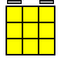		
    </td>			
  <tr>		
    <td class="cube_table_content_td" colspan="2">Orientér terningen så de to hjørnestykker med samme farve er på B-siden.</td>		
  </tr>		
</table> 

Når hjørnerne i U-laget er på plads vil en af nedenstående cases være på terningen. Identificér den og udfør algoritmen og terningen er løst.

<table class="cube_table">	
  <th colspan="6">PLL</th>		
  <tr>
    <td class="cube_table_case_td">01</td>			
    <td class="cube_table_cube_td">				
      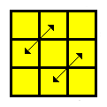			
    </td>
    <td class="cube_table_algorithm_td">(M'2 U)(M'2 U)(M' U2)(M'2 U2)(M' U2)</td>
    <td class="cube_table_case_td">02</td>
    <td class="cube_table_cube_td">				
      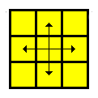	
    </td>
    <td class="cube_table_algorithm_td">(M'2 U)(M'2 U2)(M'2 U) M'2</td>		
  </tr>	
  <tr>
  <td class="cube_table_case_td">03</td>
    <td class="cube_table_cube_td">	
      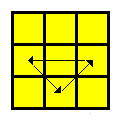	
    </td>				
    <td class="cube_table_algorithm_td">(R U' R U)(R U)(R U')(R' U' R2)</td>
    <td class="cube_table_case_td">04</td>
    <td class="cube_table_cube_td">	
      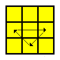		
    </td>
    <td class="cube_table_algorithm_td">(R2 U)(R U R' U')(R' U')(R' U R')</td>
  </tr>	
</table>