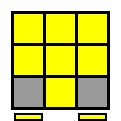
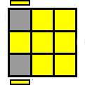
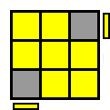

# Alternativ løsningsmetode til sidste lag</h1>
Følg den ovenstående guide til der forefindes et kryds på U-laget på terningen. Her efter vil en af følgende mønstre være i U-laget:
		
<table class="cube_table">
	<th colspan="4">OLL cases</th>
	<tr>
		<td class="cube_table_cube_td">
			
		</td>
		<td class="cube_table_algorithm_td">
			Case 1: Forlygter
		</td>
		<td class="cube_table_cube_td">
			
		</td>
		<td class="cube_table_algorithm_td">
			Case 2: Fluesmækker
		</td>
	</tr>
	<tr>
		<td class="cube_table_cube_td">
			
		</td>
		<td class="cube_table_algorithm_td">
			Case 3: Butterfly
		</td>
		<td class="cube_table_cube_td">
			
		</td>
		<td class="cube_table_algorithm_td">
			Case 4: Sune
		</td>
	</tr>
	<tr>
		<td class="cube_table_cube_td">
			
		</td>
		<td class="cube_table_algorithm_td">
			Case 5: Anti-sune
		</td>
		<td class="cube_table_cube_td">
			
		</td>
		<td class="cube_table_algorithm_td">
			Case 6: Motorcykel
		</td>
	</tr>
	<tr>
		<td class="cube_table_cube_td">
			
		</td>
		<td class="cube_table_algorithm_td">
			Case 7: Bil
		</td>
	</tr>
</table>
		
		
Orientér U-laget således at et af den ovenstående mønstre vender som på illustrationen (Det nederste lag er altid F-laget på terningen). Herefter benyttes følgende algoritme til at orienterer hjørnerne:

		
		
R U R' U R U2 R'

		
Det er vigtigt at nævne, at det ofte er nødvendigt at udføre oevnstående algoritmer flere gange, da den cycler igennem de forskellige mønstre.
 
		
		
Vær opmærksom på at orientere det nye mønster, så det vender rigtig jævnfør illustrationerne i den ovenstående tabel.

		
		<h2>Corner permutation</h2>
		
		
Efter orientering af U-laget skal hjørnerne sættes på plads. Dette gøres ved at benytte nedenstående algoritme:

		
		
R' F R' B2 R F' R' B2 R2

		
		
Det er vigtigt, at hvis der er "forlygter" på terningen, det vil sige at to hjørner vender således at to hjørner har samme farve i U-laget, skal være på B-siden af terningen. Hvis det ikke er tilfældet, kan ovenstående algoritme udføres en gang hvorpå der vil komme mønstret vil opstå i U-laget.

		
		<table class="cube_table_content">		
			<tr>
				<td class="cube_table_content_td">		
							
				</td>			
			<tr>		
				<td class="cube_table_content_td" colspan="2">Orientér terningen så de to hjørnestykker med samme farve er på B-siden.</td>		
			</tr>		
		</table>
		
		<h2>Edge permutation</h2>
		
		
Når hjørnestykkerne er løst skal kantstykkerne til sidst på plads, dette gøres med nedenstående algortime:

		
		
R U' R U R U R U' R' U' R2

		
		
Hvis der ikke er et løst kantstykke, udføres algoritmen en gang for at få det. Algoritmen cykler tre kanter mod uret, derfor kan det nødvendigt at udføre den to gange for at løse terningen.

		
		<table class="cube_table_content">		
			<tr>
				<td class="cube_table_content_td">		
							
				</td>
			</tr>
			<tr>		
			<td class="cube_table_content_td" colspan="2">Orientér terningen så det kantstykke er på B-siden.</td>		
			</tr>		
		</table>
		
		

		
	
		<?php include("../../includes/footer.php"); ?>
		

		
