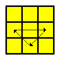

# Ekspert

<h2>First Two Layers (F2L)</h2>
<table class="cube_table">	
	<th colspan="6">Corners correct, edge not placed</th>	
	<tr>
		<td class="cube_table_case_td">01</td>		
		<td class="cube_table_cube_td">
			
		</td>
		<td class="cube_table_algorithm_td">R U’ R’ U F’ U2 F U F’ U2 F</td>
		<td class="cube_table_case_td">02</td>	
		<td class="cube_table_cube_td">
			
		</td>
		<td class="cube_table_algorithm_td">U R U R’ U’ F’ U’ F</td>
	</tr>
	<tr>
		<td class="cube_table_case_td">03</td>	
		<td class="cube_table_cube_td">
			
		</td>
		<td class="cube_table_algorithm_td">R’ U’ R’ U’ R’ U R U R</td>	
		<td></td>
		<td class="cube_table_cube_td"></td>
		<td class="cube_table_algorithm_td"></td>	
	</tr>
</table>

<table class="cube_table">	
	<th colspan="6">Edge correct, corner slot free</th>	
	<tr>
		<td class="cube_table_case_td">04</td>
		<td class="cube_table_cube_td">
			
		</td>
		<td class="cube_table_algorithm_td">R’ F R F’ R’ F R F’ R’ F R F’</td>		
		<td class="cube_table_case_td">05</td>
		<td class="cube_table_cube_td">
			
		</td>		
		<td class="cube_table_algorithm_td">U R U R’ U2 R U R’</td>	
	</tr>
	<tr>
		<td class="cube_table_case_td">06</td>
		<td class="cube_table_cube_td">
			
		</td>		
		<td class="cube_table_algorithm_td">U’ R U’ R’ U2 R U’ R’</td>
		<td></td>
		<td class="cube_table_cube_td"></td>		
		<td class="cube_table_algorithm_td"></td>	
	</tr>
</table>

<table class="cube_table">	
	<th colspan="6">Corner in first layer twisted clockwise</th>	
	<tr>
		<td class="cube_table_case_td">07</td>
		<td class="cube_table_cube_td">
			
		</td>		
		<td class="cube_table_algorithm_td">R U R’ U’ R’ U2 R U’ R (R U R’ U’ R U2 R’ U' R U R’)</td>		
		<td class="cube_table_case_td">08</td>
		<td class="cube_table_cube_td">
			
		</td>
		<td class="cube_table_algorithm_td">R U’ R’ U’ R U’ R’ U F’ U’ F</td>	
	</tr>	
	<tr>
		<td class="cube_table_case_td">09</td>
		<td class="cube_table_cube_td">
			
		</td>	
		<td class="cube_table_algorithm_td">F’ U’ F U F’ U’ F</td>
		<td class="cube_table_case_td">10</td>		
		<td class="cube_table_cube_td">
			
		</td>		
		<td class="cube_table_algorithm_td">R U’ R’ U R U’ R’</td>	
	</tr>
</table>

<table class="cube_table">
	<th colspan="6">Corner in first layer twisted counter-clockwise</th>	
	<tr>
		<td class="cube_table_case_td">11</td>
		<td class="cube_table_cube_td">
			
		</td>	
		<td class="cube_table_algorithm_td">R U’ R’ U R U2 R’ U R U’ R’</td>
		<td class="cube_table_case_td">12</td>
		<td class="cube_table_cube_td">
			
		</td>		
		<td class="cube_table_algorithm_td">R U’ R’ U2 F’ U F U’ F’ U F (R U’ R’ U2 F’ U’ F U’ F’ U F)</td>
	</tr>	
	<tr>
		<td class="cube_table_case_td">13</td>
		<td class="cube_table_cube_td">
			
		</td>	
		<td class="cube_table_algorithm_td">F’ U F U’ F’ U F</td>
		<td class="cube_table_case_td">14</td>
		<td class="cube_table_cube_td">
			
		</td>	
		<td class="cube_table_algorithm_td">R U R’ U’ R U R’</td>	
	</tr>
</table>

<table class="cube_table">	
	<th colspan="6">Corner in U layer with cross-color on U-face</th>
	<tr>
		<td class="cube_table_case_td">15</td>
		<td class="cube_table_cube_td">
			
		</td>		
		<td class="cube_table_algorithm_td">F’ U F R U2 R’</td>		
		<td class="cube_table_case_td">16</td>
		<td class="cube_table_cube_td">
			
		</td>	
		<td class="cube_table_algorithm_td">y L’ U2 L U L’ U’ L</td>	
	</tr>	
	<tr>
		<td class="cube_table_case_td">17</td>
		<td class="cube_table_cube_td">
			
		</td>
		<td class="cube_table_algorithm_td">U2 R2 U2 R’ U’ R U’ R2</td>
		<td class="cube_table_case_td">18</td>
		<td class="cube_table_cube_td">
			
		</td>
		<td class="cube_table_algorithm_td">d’ L’ U2 L U’ L’ U L</td>	
	</tr>	
	<tr>
		<td class="cube_table_case_td">19</td>
		<td class="cube_table_cube_td">
			
		</td>		
		<td class="cube_table_algorithm_td">U2 R U R’ U R U’ R’</td>		
		<td class="cube_table_case_td">20</td>
		<td class="cube_table_cube_td">
			
		</td>
		<td class="cube_table_algorithm_td">R U2 R’ U’ R U R’</td>	
	</tr>	
	<tr>
		<td class="cube_table_case_td">21</td>
		<td class="cube_table_cube_td">
			
		</td>	
		<td class="cube_table_algorithm_td">U2 F2 U2 F U F’ U F2</td>
		<td class="cube_table_case_td">22</td>
		<td class="cube_table_cube_td">
			
		</td>	
		<td class="cube_table_algorithm_td">U R U2 R’ U R U’ R’</td>
	</tr>
	<tr>
		<td class="cube_table_case_td">23</td>
		<td class="cube_table_cube_td">
			
		</td>		
		<td class="cube_table_algorithm_td">F’ U F U2 F’ U’ F</td>
		<td></td>
		<td class="cube_table_cube_td"></td>		
		<td class="cube_table_algorithm_td"></td>	
	</tr>
</table>

<table class="cube_table">	
	<th colspan="6">Corner in U layer with cross-color on R-face</th>	
	<tr>
		<td class="cube_table_case_td">24</td>
		<td class="cube_table_cube_td">
			
		</td>		
		<td class="cube_table_algorithm_td">U F’ U’ F U’ R U R’</td>		
		<td class="cube_table_case_td">25</td>
		<td class="cube_table_cube_td">
			
		</td>		
		<td class="cube_table_algorithm_td">Dw’ L’ U L</td>	
	</tr>
	<tr>
		<td class="cube_table_case_td">26</td>
		<td class="cube_table_cube_td">
			
		</td>
		<td class="cube_table_algorithm_td">U F’ U2 F U’ R U R’</td>
		<td class="cube_table_case_td">27</td>
		<td class="cube_table_cube_td">
			
		</td>
		<td class="cube_table_algorithm_td">Dw R’ U’ R U2 R’ U R</td>	
	</tr>
	<tr>
		<td class="cube_table_case_td">28</td>
		<td class="cube_table_cube_td">
			
		</td>
		<td class="cube_table_algorithm_td">U’ R U R’ U R U’ R’</td>
		<td class="cube_table_case_td">29</td>
		<td class="cube_table_cube_td">
			
		</td>		
		<td class="cube_table_algorithm_td">U’ R U’ R’ U R U R’</td>	
	</tr>	
	<tr>	
		<td class="cube_table_case_td">30</td>
		<td class="cube_table_cube_td">
			
		</td>	
		<td class="cube_table_algorithm_td">R U’ R’ U2 F’ U’ F</td>
		<td class="cube_table_case_td">31</td>
		<td class="cube_table_cube_td">
			
		</td>		
		<td class="cube_table_algorithm_td">R U R’</td>	
	</tr>
	<tr>		
		<td class="cube_table_case_td">32</td>
		<td class="cube_table_cube_td">
			
		</td>		
		<td class="cube_table_algorithm_td">Dw R’ U2 R U2 R’ U R’</td>
		<td></td>
		<td class="cube_table_cube_td"></td>		
		<td class="cube_table_algorithm_td"></td>	
	</tr>
</table>

<table class="cube_table">	
	<th colspan="6">Corner In U-Layer With Cross-Color on F-Face</th>	
	<tr>
		<td class="cube_table_case_td">33</td>
		<td class="cube_table_cube_td">
			
		</td>		
		<td class="cube_table_algorithm_td">U’ R U R’ U F’ U’ F</td>		
		<td class="cube_table_case_td">34</td>
		<td class="cube_table_cube_td">
			
		</td>		
		<td class="cube_table_algorithm_td">Dw R’ U R U’ R’ U’ R</td>	
	</tr>
	<tr>	
		<td class="cube_table_case_td">35</td>
		<td class="cube_table_cube_td">
			
		</td>
		<td class="cube_table_algorithm_td">F’ U F U2 R U R’</td>
		<td class="cube_table_case_td">36</td>
		<td class="cube_table_cube_td">
			
		</td>
		<td class="cube_table_algorithm_td">y L’ U’ L</td>	
	</tr>
	<tr>
		<td class="cube_table_case_td">37</td>
		<td class="cube_table_cube_td">
			
		</td>
		<td class="cube_table_algorithm_td">U’ R U2 R’ U2 R U’ R’</td>
		<td class="cube_table_case_td">38</td>
		<td class="cube_table_cube_td">
			
		</td>		
		<td class="cube_table_algorithm_td">U R U’ R’</td>	
	</tr>	
	<tr>
		<td class="cube_table_case_td">39</td>
		<td class="cube_table_cube_td">
			
		</td>	
		<td class="cube_table_algorithm_td">U’ R U2 R’ U F’ U’ F</td>
		<td class="cube_table_case_td">40</td>
		<td class="cube_table_cube_td">
			
		</td>		
		<td class="cube_table_algorithm_td">U’ R U R’ U2 R U’ R’</td>	
	</tr>
	<tr>
		<td class="cube_table_case_td">41</td>
		<td class="cube_table_cube_td">
			
		</td>		
		<td class="cube_table_algorithm_td">U’ R U’ R’ U F’ U’ F</td>
		<td></td>
		<td class="cube_table_cube_td"></td>		
		<td class="cube_table_algorithm_td"></td>	
	</tr>
</table>

<h2>Orient Last Layer (OLL)</h2>
<table class="cube_table">	
	<th colspan="6">Corners correct, edges flipped</th>	
	<tr>
		<td class="cube_table_case_td">01</td>
		<td class="cube_table_cube_td">
			
		</td>		
		<td class="cube_table_algorithm_td">(M' U M) U2 (M' U M)</td>		
		<td class="cube_table_case_td">02</td>
		<td class="cube_table_cube_td">
			
		</td>
		<td class="cube_table_algorithm_td">(R U R' U') (M' U R U') Rw'</td>
	</tr>
	<tr>
		<td class="cube_table_case_td">03</td>
		<td class="cube_table_cube_td">
			
		</td>		
		<td class="cube_table_algorithm_td">Rw' (R U) (R U R' U' Rw2) (R'2 U) (R U') Rw'</td>
		<td></td>		
		<td class="cube_table_cube_td"></td>
		<td class="cube_table_algorithm_td"></td>		
	</tr>
</table>

<table class="cube_table">
	<th colspan="6">All edges flipped correctly</th>
	<tr>
		<td class="cube_table_case_td">04</td>
		<td class="cube_table_cube_td">
			
		</td>
		<td class="cube_table_algorithm_td">
			(R'2 D) (R' U2) (R D') (R' U2 R')
		</td>
		<td class="cube_table_case_td">05</td>
		<td class="cube_table_cube_td">
			
		</td>
		<td class="cube_table_algorithm_td">
			(Lw' U') (L U) (R U') (Rw' F)
		</td>
	</tr>
	<tr>
		<td class="cube_table_case_td">06</td>
		<td class="cube_table_cube_td">
			
		</td>
		<td class="cube_table_algorithm_td">
			(R' F) (R B') (R' F') (R B)
		</td>
		<td class="cube_table_case_td">07</td>
		<td class="cube_table_cube_td">
			
		</td>
		<td class="cube_table_algorithm_td">
			(R U R' U) (R U'2 R')
		</td>
	</tr>
	<tr>
		<td class="cube_table_case_td">08</td>
		<td class="cube_table_cube_td">
			
		</td>
		<td class="cube_table_algorithm_td">
			(L' U' L U') (L' U2 L)
		</td>
		<td class="cube_table_case_td">09</td>
		<td class="cube_table_cube_td">
			
		</td>
		<td class="cube_table_algorithm_td">
			(R U'2) (R'2 U') (R2 U') (R'2 U'2 R)
		</td>
	</tr>
	<tr>
		<td class="cube_table_case_td">10</td>
		<td class="cube_table_cube_td">
			
		</td>
		<td class="cube_table_algorithm_td">
			F (R U R' U') (R U R' U') (R U R' U') F'
		</td>
		<td></td>
		<td class="cube_table_cube_td"></td>
		<td class="cube_table_algorithm_td"></td>
	</tr>
</table>

<table class="cube_table">
	<th colspan="6">No edges flipped correctly</th>
	<tr>
		<td class="cube_table_case_td">11</td>
		<td class="cube_table_cube_td">
			
		</td>
		<td class="cube_table_algorithm_td">
			Fw (R U R' U') Fw' U' F (R U R' U') F'
		</td>
		<td class="cube_table_case_td">12</td>
		<td class="cube_table_cube_td">
			
		</td>
		<td class="cube_table_algorithm_td">
			Fw (R U R' U') Fw' U F (R U R' U') F'
		</td>
	</tr>
	<tr>
		<td class="cube_table_case_td">13</td>
		<td class="cube_table_cube_td">
			
		</td>
		<td class="cube_table_algorithm_td">
			(R U R' U) (R' F R F') U2 (R' F R F')
		</td>
		<td class="cube_table_case_td">14</td>
		<td class="cube_table_cube_td">
			
		</td>
		<td class="cube_table_algorithm_td">
			(R' U2) F (R U R' U') y' (R'2 U2) (R B)
		</td>
	</tr>
	<tr>
		<td class="cube_table_case_td">15</td>
		<td class="cube_table_cube_td">
			
		</td>
		<td class="cube_table_algorithm_td">
			F (R U R' U) y' (R' U2) (R' F R F')
		</td>
		<td class="cube_table_case_td">16</td>
		<td class="cube_table_cube_td">
			
		</td>
		<td class="cube_table_algorithm_td">
			F (R U R' U') S (R U R' U') Fw'
		</td>
	</tr>
	<tr>
		<td class="cube_table_case_td">17</td>
		<td class="cube_table_cube_td">
			
		</td>
		<td class="cube_table_algorithm_td">
			(R U) B' (Lw U [Lw' R'] U') (R' F R F')
		</td>
		<td></td>
		<td class="cube_table_cube_td">
		</td>
		<td class="cube_table_algorithm_td">
		</td>
	</tr>
</table>

<table class="cube_table">
	<th colspan="6">"T" shapes</th>
	<tr>
		<td class="cube_table_case_td">18</td>
		<td class="cube_table_cube_td">
			
		</td>
		<td class="cube_table_algorithm_td">
			(R U R' U') (R' F R F')
		</td>
		<td class="cube_table_case_td">19</td>
		<td class="cube_table_cube_td">
			
		</td>
		<td class="cube_table_algorithm_td">
			F (R U R' U') F'
		</td>
	</tr>
</table>
	
<table class="cube_table">
	<th colspan="6">"P" shapes</th>	
	<tr>
		<td class="cube_table_case_td">20</td>
		<td class="cube_table_cube_td">
			
		</td>
		<td class="cube_table_algorithm_td">
			Fw (R U R' U') Fw'
		</td>
		<td class="cube_table_case_td">21</td>
		<td class="cube_table_cube_td">
			
		</td>
		<td class="cube_table_algorithm_td">
			Fw' (L' U' L U) Fw
		</td>
	</tr>
	<tr>
		<td class="cube_table_case_td">22</td>
		<td class="cube_table_cube_td">
			
		</td>
		<td class="cube_table_algorithm_td">
			(R Dw) (L' Dw') (R' U) (Lw U Lw')
		</td>
		<td class="cube_table_case_td">23</td>
		<td class="cube_table_cube_td">
			
		</td>
		<td class="cube_table_algorithm_td">
			(L' Dw') (R Dw) (L U') (Rw' U' Rw)
		</td>
	</tr>
</table>

<table class="cube_table">
	<th colspan="6">"W" shapes</th>
	<tr>
		<td class="cube_table_case_td">24</td>
		<td class="cube_table_cube_td">
			
		</td>
		<td class="cube_table_algorithm_td">
			(R U R' U) (R U' R' U') (R' F R F')
		</td>
		<td class="cube_table_case_td">25</td>
		<td class="cube_table_cube_td">
			
		</td>
		<td class="cube_table_algorithm_td">
			(L' U' L U') (L' U L U) (L F' L' F)
		</td>
	</tr>
</table>

<table class="cube_table">
	<th colspan="6">"L" shapes</th>	
	<tr>
		<td class="cube_table_case_td">26</td>
		<td class="cube_table_cube_td">
			
		</td>
		<td class="cube_table_algorithm_td">
			(Rw U) (R' U) (R U') (R' U) (R U'2 Rw')
		</td>
		<td class="cube_table_case_td">27</td>
		<td class="cube_table_cube_td">
			
		</td>
		<td class="cube_table_algorithm_td">
			(Rw' U') (R U') (R' U) (R U') (R' U2 Rw)
		</td>
	</tr>
	<tr>
		<td class="cube_table_case_td">28</td>
		<td class="cube_table_cube_td">
			
		</td>
		<td class="cube_table_algorithm_td">
			(R B' R B R'2) U2 (F R' F' R)
		</td>
		<td class="cube_table_case_td">29</td>
		<td class="cube_table_cube_td">
			
		</td>
		<td class="cube_table_algorithm_td">
			(R' F R' F' R2) U2 y (R' F R F')
		</td>
	</tr>
	<tr>
		<td class="cube_table_case_td">30</td>
		<td class="cube_table_cube_td">
			
		</td>
		<td class="cube_table_algorithm_td">
			F (R U R' U') (R U R' U') F'
		</td>
		<td class="cube_table_case_td">31</td>
		<td class="cube_table_cube_td">
			
		</td>
		<td class="cube_table_algorithm_td">
			F' (L' U' L U) (L' U' L U) F
		</td>
	</tr>
</table>

<table class="cube_table">
	<th colspan="6">Big lightning bolts</th>
	<tr>
		<td class="cube_table_case_td">32</td>
		<td class="cube_table_cube_td">
			
		</td>
		<td class="cube_table_algorithm_td">
			(R B') (R' U' R U) y (R U') F'
		</td>
		<td class="cube_table_case_td">33</td>
		<td class="cube_table_cube_td">
			
		</td>
		<td class="cube_table_algorithm_td">
			(L' B) (L U L' U') y' (L' U) F
		</td>
	</tr>
</table>

<table class="cube_table">
	<th colspan="6">"C" shapes</th>
	<tr>
		<td class="cube_table_case_td">34</td>
		<td class="cube_table_cube_td">
			
		</td>
		<td class="cube_table_algorithm_td">
			(R U R'2 U') (R' F) (R U) (R U') F'
		</td>
		<td class="cube_table_case_td">35</td>
		<td class="cube_table_cube_td">
			
		</td>
		<td class="cube_table_algorithm_td">
			B' (R' U' R) y (R U') (R' U2 R)
		</td>
	</tr>
</table>

<table class="cube_table">
	<th colspan="6">Squares</th>
	<tr>
		<td class="cube_table_case_td">36</td>
		<td class="cube_table_cube_td">
			
		</td>
		<td class="cube_table_algorithm_td">
			B' (R'2 F) (R F' R B)
		</td>
		<td class="cube_table_case_td">37</td>
		<td class="cube_table_cube_td">
			
		</td>
		<td class="cube_table_algorithm_td">
			(Lw U2) (L' U' L U' Lw')
		</td>
	</tr>
</table>

<table class="cube_table">
	<th colspan="6">Small lightning bolts</th>
	<tr>
		<td class="cube_table_case_td">38</td>
		<td class="cube_table_cube_td">
			
		</td>
		<td class="cube_table_algorithm_td">
			(Lw U L' U) (L U'2 Lw')
		</td>
		<td class="cube_table_case_td">39</td>
		<td class="cube_table_cube_td">
			
		</td>
		<td class="cube_table_algorithm_td">
			F (R U R' U') F' U F (R U R' U') F'
		</td>
	</tr>
	<tr><td class="cube_table_case_td">40</td>
		<td class="cube_table_cube_td">
			
		</td>
		<td class="cube_table_algorithm_td">
			(Rw' U' R U') (R' U2 Rw)
		</td>
		<td class="cube_table_case_td">41</td>
		<td class="cube_table_cube_td">
			
		</td>
		<td class="cube_table_algorithm_td">
			F' (L' U' L U) F U F (R U R' U') F'
		</td>
	</tr>
</table>

<table class="cube_table">
	<th colspan="6">Fish shapes</th>
	<tr>
		<td class="cube_table_case_td">42</td>
		<td class="cube_table_cube_td">
			
		</td>
		<td class="cube_table_algorithm_td">
			F (R U') (R' U' R U) (R' F')
		</td>
		<td class="cube_table_case_td">43</td>
		<td class="cube_table_cube_td">
			
		</td>
		<td class="cube_table_algorithm_td">
			(L U'2) (L'2 B) (L B' L U'2 L')
		</td>
	</tr>
	<tr>
		<td class="cube_table_case_td">44</td>
		<td class="cube_table_cube_td">
			
		</td>
		<td class="cube_table_algorithm_td">
			(L U L') yx (L' U) (L F') (L' U' L)
		</td>
		<td class="cube_table_case_td">45</td>
		<td class="cube_table_cube_td">
			
		</td>
		<td class="cube_table_algorithm_td">
			(R' U' R) y'x' (R U') (R' F) (R U R')
		</td>
	</tr>
</table>

<table class="cube_table">
	<th colspan="6">"I" shapes</th>
	<tr>
		<td class="cube_table_case_td">46</td>
		<td class="cube_table_cube_td">
			
		</td>
		<td class="cube_table_algorithm_td">
			Fw (R U R' U') (R U R' U') Fw'
		</td>
		<td class="cube_table_case_td">47</td>
		<td class="cube_table_cube_td">
			
		</td>
		<td class="cube_table_algorithm_td">
			(R U R' U R Dw') (R U' R' F')
		</td>
	</tr>
	<tr>
		<td class="cube_table_case_td">48</td>
		<td class="cube_table_cube_td">
			
		</td>
		<td class="cube_table_algorithm_td">
			F (R U R' U' R) y' (R' F) (R B') (R' F')
		</td>
		<td class="cube_table_case_td">49</td>
		<td class="cube_table_cube_td">
			
		</td>
		<td class="cube_table_algorithm_td">
			(R' U2) (R'2 U) (R' U) (R U'2) x' (U' R' U)
		</td>
	</tr>
</table>

<table class="cube_table">
	<th colspan="6">"Knight move" shapes</th>
	<tr>
		<td class="cube_table_case_td">50</td>
		<td class="cube_table_cube_td">
			
		</td>
		<td class="cube_table_algorithm_td">
			x' (R U' R' F') (R U R') xy (R' U R)
		</td>
		<td class="cube_table_case_td">51</td>
		<td class="cube_table_cube_td">
			
		</td>
		<td class="cube_table_algorithm_td">
			(Rw U Rw') (R U R' U') (Rw U' Rw')
		</td>
	</tr>
	<tr>
		<td class="cube_table_case_td">52</td>
		<td class="cube_table_cube_td">
			
		</td>
		<td class="cube_table_algorithm_td">
			x' (L' U L F) (L' U' L) xy' (L U' L')
		</td>
		<td class="cube_table_case_td">53</td>
		<td class="cube_table_cube_td">
			
		</td>
		<td class="cube_table_algorithm_td">
			(Lw' U' Lw) (L' U' L U) (Lw' U Lw)
		</td>
	</tr>
</table>

<table class="cube_table">
	<th colspan="6">The "Awkward" shapes</th>
	<tr>
		<td class="cube_table_case_td">54</td>
		<td class="cube_table_cube_td">
			
		</td>
		<td class="cube_table_algorithm_td">
			(R U') (R' U2) (R U) y (R U') (R' U' F')
		</td>
		<td class="cube_table_case_td">55</td>
		<td class="cube_table_cube_td">
			
		</td>
		<td class="cube_table_algorithm_td">
			(R'2 U R' B') (R U') (R'2 U) (Lw U Lw')
		</td>
	</tr>
	<tr>
		<td class="cube_table_case_td">56</td>
		<td class="cube_table_cube_td">
			
		</td>
		<td class="cube_table_algorithm_td">
			(L' U) (L U'2) (L' U') y' (L' U) (L U F)
		</td>
		<td class="cube_table_case_td">57</td>
		<td class="cube_table_cube_td">
			
		</td>
		<td class="cube_table_algorithm_td">
			(L2 U' L B) (L' U) (L2 U') (Rw' U' Rw)
		</td>
	</tr>
</table>

<h2>Permute Last Layer (PLL)</h2>

<table class="cube_table">	
	<th colspan="6">Corners only</th>	
	<tr>
		<td class="cube_table_case_td">01</td>
		<td class="cube_table_cube_td">
			
		</td>		
		<td class="cube_table_algorithm_td">
			(Lw' U R') D2 (R U' R') D2 R2
		</td>
		<td class="cube_table_case_td">02</td>		
		<td class="cube_table_cube_td">
			
		</td>
		<td class="cube_table_algorithm_td">
			(Rw U' L) D2 (L' U L) D2 L2
		</td>
	</tr>
	<tr>
		<td class="cube_table_case_td">03</td>
		<td class="cube_table_cube_td">
			
		</td>		
		<td class="cube_table_algorithm_td">
			x' (R U') (R' D) (R U R') Uw'2 (R' U) (R D) (R' U' R)
		</td>
		<td></td>
		<td class="cube_table_cube_td"></td>
		<td class="cube_table_algorithm_td"></td>		
	</tr>
</table>

<table class="cube_table">
	<th colspan="6">Edges only</th>
	<tr>
		<td class="cube_table_case_td">04</td>
		<td class="cube_table_cube_td">
			
		</td>
		<td class="cube_table_algorithm_td">
			(M'2 U M)(M'2 U)(M' U2)(M'2 U2)(M' U2)
		</td>
		<td class="cube_table_case_td">05</td>
		<td class="cube_table_cube_td">
			
		</td>
		<td class="cube_table_algorithm_td">
			(M'2 U)(M'2 U2)(M'2 U) M'2
		</td>
	</tr>
	<tr>
		<td class="cube_table_case_td">06</td>
		<td class="cube_table_cube_td">
			
		</td>
		<td class="cube_table_algorithm_td">
			(R U' R U)(R U)(R U')(R' U' R2)
		</td>
		<td class="cube_table_case_td">07</td>
		<td class="cube_table_cube_td">
			
		</td>
		<td class="cube_table_algorithm_td">
			(R2 U)(R U R' U')(R' U')(R' U R')
		</td>
	</tr>
</table>

<table class="cube_table">
	<th colspan="6">Swapping to adjacent corners and two edges</th>
	<tr>
		<td class="cube_table_case_td">08</td>
		<td class="cube_table_cube_td">
			
		</td>
		<td class="cube_table_algorithm_td">
			(R' U L') U2 (R U' R') U2 (L R U')
		</td>
		<td class="cube_table_case_td">09</td>
		<td class="cube_table_cube_td">
			
		</td>
		<td class="cube_table_algorithm_td">
			(R U R' F') (R U R' U') (R' F) (R2 U') (R' U')
		</td>
	</tr>
	<tr>
		<td class="cube_table_case_td">10</td>
		<td class="cube_table_cube_td">
			
		</td>
		<td class="cube_table_algorithm_td">
			(R U R' U') (R' F) (R2 U') (R' U' R U) (R' F')
		</td>
		<td class="cube_table_case_td">11</td>
		<td class="cube_table_cube_td">
			
		</td>
		<td class="cube_table_algorithm_td">
			(R' U2) (R U2) (R' F R U R' U') (R' F' R2 U')
		</td>
	</tr>
	<tr>
		<td class="cube_table_case_td">12</td>
		<td class="cube_table_cube_td">
			
		</td>
		<td class="cube_table_algorithm_td">
			(L U'2) (L' U'2) (L F' L' U' L U) (L F L'2 U)
		</td>
		<td class="cube_table_case_td">13</td>
		<td class="cube_table_cube_td">
			
		</td>
		<td class="cube_table_algorithm_td">
			(R U') (R' U R'2) y (R U R' U' F' Dw) (R'2 F R F')
		</td>
	</tr>
</table>

<table class="cube_table">
	<th colspan="6">Cycling three corners and three edges</th>
	<tr>
		<td class="cube_table_case_td">14</td>
		<td class="cube_table_cube_td">
			
		</td>
		<td class="cube_table_algorithm_td">
			(R'2 Uw' R U') (R U R' Uw R2) y (R U' R')
		</td>
		<td class="cube_table_case_td">15</td>
		<td class="cube_table_cube_td">
			
		</td>
		<td class="cube_table_algorithm_td">
			(R'2 Uw) (R' U R' U' R Uw') R'2 y' (R' U R)
		</td>
	</tr>
	<tr>
		<td class="cube_table_case_td">16</td>
		<td class="cube_table_cube_td">
			
		</td>
		<td class="cube_table_algorithm_td">
			(R' U' R) y (R'2 Uw R' U) (R U' R Uw' R'2)
		</td>
		<td class="cube_table_case_td">17</td>
		<td class="cube_table_cube_td">
			
		</td>
		<td class="cube_table_algorithm_td">
			(R U R') y' (R'2 Uw' R U') (R' U R' Uw R2)
		</td>
	</tr>
</table>

<table class="cube_table">
	<th colspan="6">Permutations of two diagonal corners and two edges</th>
	<tr>
		<td class="cube_table_case_td">18</td>
		<td class="cube_table_cube_td">
			
		</td>
		<td class="cube_table_algorithm_td">
			(R' U R' Dw') x (Lw' U R' U') (Lw R U') (R' U R U)
		</td>
		<td class="cube_table_case_td">19</td>
		<td class="cube_table_cube_td">
			
		</td>
		<td class="cube_table_algorithm_td">
			(R U') (R' U) (Lw U) (F U') (R' F') (R U' R U) (Lw' U R')
		</td>
	</tr>
	<tr>
		<td class="cube_table_case_td">20</td>
		<td class="cube_table_cube_td">
			
		</td>
		<td class="cube_table_algorithm_td">
			(L' U) (L U') (Rw' U') (F' U) (L F) (L' U L' U') (Rw U' L)
		</td>
		<td class="cube_table_case_td">21</td>
		<td class="cube_table_cube_td">
			
		</td>
		<td class="cube_table_algorithm_td">
			(F R U') (R' U' R U) (R' F') (R U R' U') (R' F R F')
		</td>
	</tr>
</table>