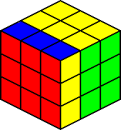
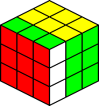

# Notation
For at kunne forstå de mange algoritmer her på siden skal man være fortrolig med en række notationer der bruges til at beskrive træk på terningen.

Følgende symboler anvendes til at beskrive de seks sider på terningen.
- F (front face)
- B (back face)
- R (right face)
- L (left face)
- U (upper face)
- D (down face)

Face moves
- Med uret, 90 grader: F, B, R , L, U, D
- Mod uret, 90 grader: F', B', R', L', U', D'
- Med uret, 180 grader: F2, B2, R2, L2, U2, D2
- Mod uret, 180 grader: F'2, B'2, R'2, L'2, U'2, D'2
		
Double outer slice moves
- Med uret, 90 grader: Fw, Bw, Rw, Lw, Uw, Dw
- Mod uret, 90 grader: Fw', Bw', Rw', Lw', Uw', Dw'
- Med uret, 180 grader: Fw2, Bw2, Rw2, Lw2, Uw2, Dw2
- Mod uret, 180 grader: Fw'2, Bw'2, Rw'2, Lw'2, Uw'2, Dw'2

Middle slice moves
- Med uret, 90 grader: M, S, E
- Mod uret, 90 grader: M', S', E'
- Med uret, 180 grader: M2, S2, E2
- Mod uret, 180 grader: M'2, S'2, E'2
		
_M drejes samme retning som L, S drejes i samme retning som F, E drejes i samme retning som D._
		
Cube rotations
- Med uret, 90 grader: z eller [f], z' eller [b], x eller [r], x' eller [l], y eller [u], y' eller [d]
- Mod uret, 90 grader: z' eller [f'], z eller [b'], x' eller [r'], x eller [l'], y' eller [u'], y eller [d']
- Med uret, 180 grader: z2 eller [f2], z2 eller [b2], x2 eller [r2], x2 eller [l2], y2 eller [u2], y2 eller [d2]
- Mod uret, 180 grader: z'2 eller [f'2], z'2 eller [b'2], x'2 eller [r'2], x'2 eller [l'2], y'2 eller [u'2], y'2 eller [d'2]

For alle illustationer her på siden gælder det at F = rød, B = orange, R = grøn, L = blå, U = gul og D = hvid.

## Face Moves
		
<table class="cube_table">
	<th colspan="6">Face Moves</th>
	<tr>
		<td class="cube_table_cube_td"></td>
		<td class="cube_table_algorithm_td">F</td>
		<td class="cube_table_cube_td"></td>
		<td class="cube_table_algorithm_td">F'</td>
		<td class="cube_table_cube_td"></td>
		<td class="cube_table_algorithm_td">F2</td>
	</tr>
	<tr>
		<td class="cube_table_cube_td"></td>
		<td class="cube_table_algorithm_td">R</td>
		<td class="cube_table_cube_td"></td>
		<td class="cube_table_algorithm_td">R'</td>
		<td class="cube_table_cube_td"></td>
		<td class="cube_table_algorithm_td">R2</td>
	</tr>
	<tr>
		<td class="cube_table_cube_td"></td>
		<td class="cube_table_algorithm_td">L</td>
		<td class="cube_table_cube_td"></td>
		<td class="cube_table_algorithm_td">L'</td>
		<td class="cube_table_cube_td"></td>
		<td class="cube_table_algorithm_td">L2</td>
	</tr>
	<tr>
		<td class="cube_table_cube_td"></td>
		<td class="cube_table_algorithm_td">U</td>
		<td class="cube_table_cube_td"></td>
		<td class="cube_table_algorithm_td">U'</td>
		<td class="cube_table_cube_td"></td>
		<td class="cube_table_algorithm_td">U2</td>
	</tr>
	<tr>
		<td class="cube_table_cube_td"></td>
		<td class="cube_table_algorithm_td">B</td>
		<td class="cube_table_cube_td"></td>
		<td class="cube_table_algorithm_td">B'</td>
		<td class="cube_table_cube_td"></td>
		<td class="cube_table_algorithm_td">B2</td>			
	</tr>
	<tr>
		<td class="cube_table_cube_td"></td>
		<td class="cube_table_algorithm_td">D</td>
		<td class="cube_table_cube_td"></td>
		<td class="cube_table_algorithm_td">D'</td>
		<td class="cube_table_cube_td"></td>
		<td class="cube_table_algorithm_td">D2</td>
	</tr>
</table>
		
		<table class="cube_table">
		<th colspan="6">Double Outer Slice Moves</th>
		<tr>
			<td class="cube_table_cube_td"></td>
			<td class="cube_table_algorithm_td">Fw</td>
			<td class="cube_table_cube_td"></td>
			<td class="cube_table_algorithm_td">Fw'</td>
			<td class="cube_table_cube_td"></td>
			<td class="cube_table_algorithm_td">Fw2</td>
		</tr>
		<tr>
			<td class="cube_table_cube_td"></td>
			<td class="cube_table_algorithm_td">Rw</td>
			<td class="cube_table_cube_td"></td>
			<td class="cube_table_algorithm_td">Rw'</td>
			<td class="cube_table_cube_td"></td>
			<td class="cube_table_algorithm_td">Rw2</td>
		</tr>
		<tr>
			<td class="cube_table_cube_td"></td>
			<td class="cube_table_algorithm_td">Lw</td>
			<td class="cube_table_cube_td"></td>
			<td class="cube_table_algorithm_td">Lw'</td>
			<td class="cube_table_cube_td"></td>
			<td class="cube_table_algorithm_td">Lw2</td>
		</tr>
		<tr>
			<td class="cube_table_cube_td"></td>
			<td class="cube_table_algorithm_td">Uw</td>
			<td class="cube_table_cube_td"></td>
			<td class="cube_table_algorithm_td">Uw'</td>
			<td class="cube_table_cube_td"></td>
			<td class="cube_table_algorithm_td">Uw2</td>
		</tr>
		<tr>
			<td class="cube_table_cube_td"></td>
			<td class="cube_table_algorithm_td">Bw</td>
			<td class="cube_table_cube_td"></td>
			<td class="cube_table_algorithm_td">Bw'</td>
			<td class="cube_table_cube_td"></td>
			<td class="cube_table_algorithm_td">Bw2</td>
		</tr>
		<tr>
			<td class="cube_table_cube_td"></td>
			<td class="cube_table_algorithm_td">Dw</td>
			<td class="cube_table_cube_td"></td>
			<td class="cube_table_algorithm_td">Dw'</td>
			<td class="cube_table_cube_td"></td>
			<td class="cube_table_algorithm_td">Dw2</td>
		</tr>
		</table>
		
		<h2>Middle Slice Moves</h2>
		
		<table class="cube_table">
		<th colspan="6">Middle Slice Moves</th>
		<tr>
			<td class="cube_table_cube_td"></td>
			<td class="cube_table_algorithm_td">M</td>
			<td class="cube_table_cube_td"></td>
			<td class="cube_table_algorithm_td">M'</td>
			<td class="cube_table_cube_td"></td>
			<td class="cube_table_algorithm_td">M2</td>
		</tr>
		<tr>
			<td class="cube_table_cube_td"></td>
			<td class="cube_table_algorithm_td">E</td>
			<td class="cube_table_cube_td"></td>
			<td class="cube_table_algorithm_td">E'</td>
			<td class="cube_table_cube_td"></td>
			<td class="cube_table_algorithm_td">E2</td>
		</tr>
		<tr>
			<td class="cube_table_cube_td"></td>
			<td class="cube_table_algorithm_td">S</td>
			<td class="cube_table_cube_td"></td>
			<td class="cube_table_algorithm_td">S'</td>
			<td class="cube_table_cube_td"></td>
			<td class="cube_table_algorithm_td">S2</td>
		</tr>
		</table>
		
		<h2>Cube Rotations</h2>
		
		<table class="cube_table">
		<th colspan="6">Cube Rotations</th>
		<tr>
			<td class="cube_table_cube_td"></td>
			<td class="cube_table_algorithm_td">x</td>
			<td class="cube_table_cube_td"></td>
			<td class="cube_table_algorithm_td">x'</td>
			<td class="cube_table_cube_td"></td>
			<td class="cube_table_algorithm_td">x2</td>
		</tr>
		<tr>
			<td class="cube_table_cube_td"></td>
			<td class="cube_table_algorithm_td">y</td>
			<td class="cube_table_cube_td"></td>
			<td class="cube_table_algorithm_td">y'</td>
			<td class="cube_table_cube_td"></td>
			<td class="cube_table_algorithm_td">y2</td>
		</tr>
		<tr>
			<td class="cube_table_cube_td"></td>
			<td class="cube_table_algorithm_td">z</td>
			<td class="cube_table_cube_td"></td>
			<td class="cube_table_algorithm_td">z'</td>
			<td class="cube_table_cube_td"></td>
			<td class="cube_table_algorithm_td">z2</td>
		</tr>
		</table>
		
	

	

		<?php include("../includes/footer.php"); ?>
	

